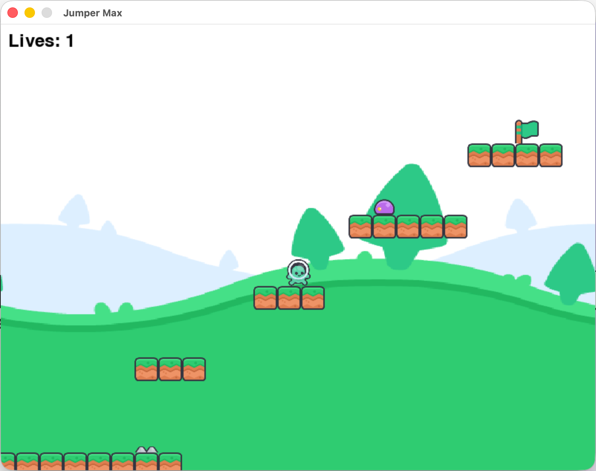

# 🎮 Jumper Max

2D-платформер на Python и PyGame. Игрок прыгает по платформам, уворачивается от шипов и врагов и добирается до финишного флага 🏁

## 📸 Скриншот



## ✨ Возможности

- 🏃 Управление персонажем: бег влево/вправо, прыжок
- 🗺️ Три экрана уровня с прокруткой камеры (2400 × 608 px)
- 🔥 Препятствия: шипы и патрулирующие враги
- ❤️ Система жизней (3 попытки) с респавном
- 🏆 Экраны победы и проигрыша, рестарт по клавише R

## 🕹️ Управление

| Клавиша | Действие |
|---------|----------|
| ← →     | Движение влево / вправо |
| Пробел  | Прыжок |
| R       | Рестарт (после Game Over или победы) |

## 🚀 Установка и запуск

```bash
# Клонировать репозиторий
git clone https://github.com/<ваш-аккаунт>/platformer-game.git
cd platformer-game

# Создать виртуальное окружение и установить зависимости
python -m venv .venv
source .venv/bin/activate        # macOS / Linux
# .venv\Scripts\activate         # Windows
pip install pygame

# Запустить игру
python main.py
```

## 📁 Структура проекта

```
platformer-game/
├── main.py        — игровой цикл, камера, обработка столкновений
├── player.py      — класс игрока: движение, гравитация, прыжок
├── level.py       — карта уровня из трёх экранов, классы Platform и Goal
├── traps.py       — шипы (Spike) и враги (Enemy)
├── config.py      — константы: размеры окна, физика, скорости
├── ui.py          — отрисовка жизней, экранов Game Over и You Win
└── assets/        — спрайты: игрок, тайлы, шипы, враги, фон
```

## 🛠️ Технологии

- **Python 3.12+** 🐍
- **PyGame 2.6** 🕹️

## 👾 Авторы

Учебный проект Skillbox — [@malibukafnks-ux](https://github.com/malibukafnks-ux)

## 📜 Лицензия ассетов

Графика — [Kenney New Platformer Pack](https://kenney.nl/assets) (CC0) 🎨
